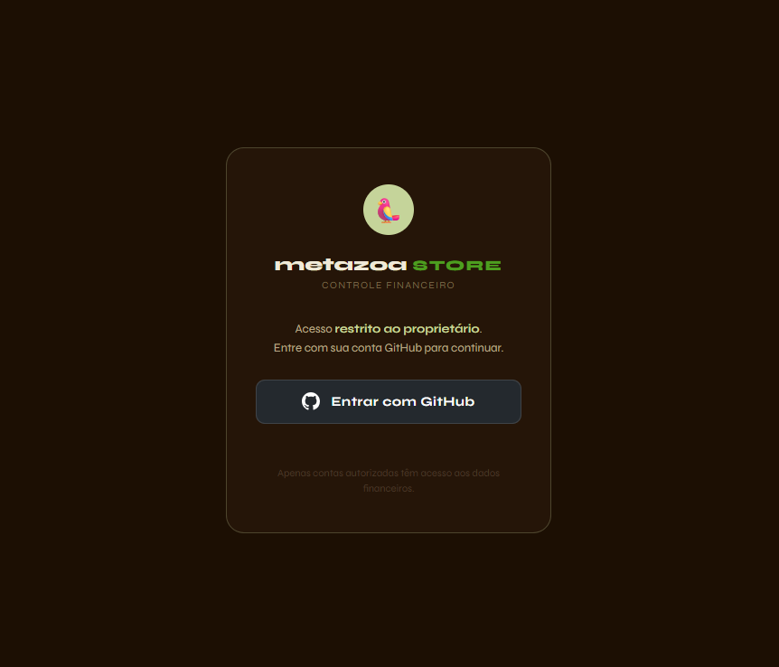
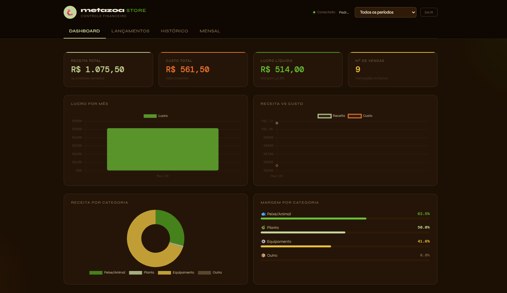

# 🦜 Metazoa Store — Controle Financeiro

Sistema de gestão financeira desenvolvido para a **Metazoa Store**, loja de aquarismo e animais ornamentais. Permite registrar vendas, acompanhar lucros e analisar o desempenho financeiro do negócio em tempo real.

**[→ Acessar o sistema](https://metazoa-financas.vercel.app)**

---

## 📸 Preview

| Login | Dashboard |
|---|---|
|  |  |

---

## ✨ Funcionalidades

- **Dashboard** com KPIs em tempo real — receita, custo, lucro e margem
- **Gráficos interativos** — lucro mensal, receita vs custo e distribuição por categoria
- **Registro de transações** com cálculo automático de lucro e margem
- **Histórico** com busca e filtro por categoria
- **Resumo mensal** consolidado
- **Filtro por período** aplicado em todo o sistema simultaneamente
- **Autenticação via GitHub OAuth** — acesso restrito ao proprietário
- **Dados persistidos** em banco PostgreSQL via Supabase

---

## 🛠️ Tecnologias

| Tecnologia | Uso |
|---|---|
| HTML, CSS, JavaScript | Frontend single-page |
| [Supabase](https://supabase.com) | Banco de dados PostgreSQL + Auth |
| [Chart.js](https://www.chartjs.org) | Gráficos interativos |
| [Vercel](https://vercel.com) | Deploy e hospedagem |
| GitHub OAuth | Autenticação segura |

---

## 🔐 Segurança

- Login obrigatório via GitHub OAuth
- Row Level Security (RLS) ativo no Supabase — apenas o usuário proprietário pode ler e escrever dados
- Chave `anon` pública do Supabase (projetada para ser exposta no frontend)
- Dados financeiros inacessíveis a qualquer outra conta autenticada

---

## 📁 Estrutura

```
metazoa-financas/
└── index.html              # Aplicação completa (single-file)
└── screenshot-login.png
└── screenshot-dashboard.png
```

---

## 🚀 Como rodar localmente

1. Clone o repositório
```bash
git clone https://github.com/PedroMSBarros/Metazoa-financas.git
```

2. Abra o `index.html` no navegador

> ⚠️ O login com GitHub redireciona para o Supabase — para funcionar localmente adicione `http://localhost` nas Redirect URLs do seu projeto Supabase.

---

## 🗄️ Configuração do banco (Supabase)

Crie a tabela `transactions` com o seguinte SQL:

```sql
CREATE TABLE transactions (
  id TEXT PRIMARY KEY,
  name TEXT NOT NULL,
  cat TEXT NOT NULL DEFAULT 'other',
  qty INTEGER NOT NULL DEFAULT 1,
  cost NUMERIC(10,2) NOT NULL,
  price NUMERIC(10,2) NOT NULL,
  date TEXT NOT NULL,
  created_at TIMESTAMPTZ DEFAULT NOW()
);

ALTER TABLE transactions ENABLE ROW LEVEL SECURITY;

CREATE POLICY "owner_only" ON transactions
  FOR ALL USING (auth.uid() = 'SEU-UUID-AQUI')
  WITH CHECK (auth.uid() = 'SEU-UUID-AQUI');
```

---

## 👨‍💻 Autor

**Pedro Barros** — [@PedroMSBarros](https://github.com/PedroMSBarros)

Estudante de Ciência da Computação | Desenvolvedor & Empreendedor

---

*Desenvolvido para uso interno da [Metazoa Store](https://metazoastore.vercel.app) 🐠*
